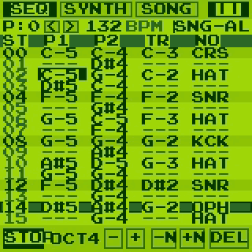

# Game Boy Music Sequencer for WASM-4 (in D Language)

> 🎮 **Play Live in Browser**: [https://klknn.github.io/wasm4-seq/](https://klknn.github.io/wasm4-seq/)

A full-featured retro music tracker and synthesizer sequencer written in **D (`-betterC`)** for the [WASM-4](https://wasm4.org) fantasy console. It enables composing authentic 4-channel Game Boy style chiptune tracks with real-time synthesizer controls, persistent disk storage, and built-in demo songs.

🎬 **Watch Video with Sound**: [megaman.mp4](megaman.mp4)

<p align="center">
  <a href="megaman.mp4">
    
  </a>
  <br>
  <em>(Click preview above or <a href="megaman.mp4">click here</a> to play video with full stereo sound)</em>
</p>

---

## Features

### 1. 4-Channel Game Boy Sound Synthesizers ([WASM-4 Audio API](https://wasm4.org/docs/guides/audio))
- **Pulse 1 (Lead / Melody)**:
  - Duty Cycle: `12.5%`, `25%`, `50%`, `75%`
  - Full ADSR envelope control (Attack, Decay, Sustain, Release)
  - Peak and Sustain Volume (0–100%)
  - Channel mute toggle
- **Pulse 2 (Counter-melody / Arpeggios)**:
  - Duty Cycle: `12.5%`, `25%`, `50%`, `75%`
  - ADSR envelope and volume levels
  - Channel mute toggle
- **Triangle (Bassline)**:
  - Pure triangle waveform for warm, punchy 8-bit basslines
  - ADSR envelope and volume controls
  - Channel mute toggle
- **Noise (Game Boy Percussion & SFX)**:
  - **6 Dedicated Drum Pads with Independent Synthesizers**:
    - `KCK` (Punchy downward pitch-slide 7-bit kick)
    - `SNR` (Crisp 15-bit white noise snare burst)
    - `HAT` (Tight closed metallic hi-hat click)
    - `OPH` (Sizzling open hi-hat decay)
    - `CRS` (Shimmering long cymbal crash)
    - `ZAP` (Retro arcade laser / tom pitch drop)
  - **Per-Pad Controls**: Each drum pad now has its own independent **Attack, Decay, Sustain, Release, Peak Volume, and Sustain Volume**!
  - Select any pad in `[SYNTH] > [NOISE]` to shape its sound independently with real-time audio audition.

### 2. Tracker & Step Sequencer Interface
- **All 16 steps visible on screen simultaneously** at 160×160 resolution!
- Real-time playhead tracking with highlight bar and beat separators (steps 0, 4, 8, 12).
- Up to 4 independent patterns (Pattern 0 to 3) per song.
- Arranger playlist chaining: chain patterns into a full arrangement (e.g. `P0 -> P1 -> P2 -> P3`).
- Toggle between `PLAY FULL SONG` (arranger playback) and `LOOP PATTERN`.
- Fractional frame tick accumulator locking playback to exact BPM timing (60–240 BPM) at 60 Hz.

### 3. Save & Load ([WASM-4 Persistent Storage](https://wasm4.org/docs/guides/saving-data))
- Uses WASM-4's `diskw` and `diskr` persistent cartridge storage.
- Compact binary layout (~560 bytes) fits well within the 1024-byte hardware limit.
- Saves patterns, synth parameters, tempo, and song arrangement chain.
- Automatic restore on startup if saved song is detected.
- On-screen notification banners for save and load operations.

### 4. Cool Demo Song Preloaded
- An original high-energy 4-pattern Game Boy chiptune ("Chiptune Quest"):
  - **Pattern 0 (Main Theme)**: Catchy pentatonic lead + 16th-note arpeggios + bouncy octave bass + tight beat.
  - **Pattern 1 (Anthem Climax)**: High melody + harmonized countermelody + walking bass + double-kick rock rhythm.
  - **Pattern 2 (Speed Run Solo)**: Rapid 16th arpeggio blitz + syncopated off-beat stabs + pumping bass + zap accents.
  - **Pattern 3 (Breakdown & Drop)**: Sustained dramatic chords + rising echoes + sub-bass groove + snare crescendo drop.

### 5. Dual Input Controls (Mouse & Gamepad / Keyboard)
- **Keyboard / Gamepad (Modal Tracker Controls)**:
  - **Navigation Mode (`[NAV]`)**:
    - **Arrow Keys (↑ ↓ ← →)**: Navigate cursor across steps and channels (with smooth key repeat).
    - **Button 1 (`X` key)**: Select cell and enter **Value Input Mode** (`[EDIT]`). Inserts base note if empty.
    - **Button 2 (`Z` key)**: Delete note back to `---` (rest), or toggle Play/Stop when cell is empty.
  - **Value Input Mode (`[EDIT]`)**:
    - **Up / Down (↑ ↓)**: Raise / lower pitch by 1 semitone (or cycle drum sounds) with instant audio preview.
    - **Left / Right (← →)**: Jump pitch down / up by a full octave (12 semitones) for rapid composing.
    - **Button 2 (`Z` key)**: Deselect / exit back to Navigation Mode.
    - **Button 1 (`X` key)**: Confirm and exit back to Navigation Mode.
- **Mouse / Touch & Bottom Toolbar**:
  - **`[?]` Button**: Opens the on-screen **User Manual & Key Bindings** cheat-sheet overlay.
  - **`OCT [-] [+]`**: Sets the default **Octave** (1–7) used when inserting new notes into empty cells (`---`).
  - **`[NAV]` / `[EDIT]`**: Toggles between Navigation Mode and Value Input Mode.
  - **`[-]` / `[+]`**: Fine-tunes note pitch up/down by 1 semitone.
  - **`[DEL]`**: Deletes the note at cursor.
  - Click any tab (`SEQ`, `SYNTH`, `SONG`) to switch views.
  - Click any cell in the grid to audition and select it; click the selected cell again to toggle `[EDIT]` mode.
  - Right-click any cell to clear it.

### 6. Retro Themes
- 4 color palettes switchable on the fly:
  - `DMG GREEN` (Classic Game Boy olive green)
  - `POCKET B&W` (Clean grayscale)
  - `CYBER NEON` (Vibrant cyan/purple synth)
  - `AMBER CRT` (Warm vintage display)

---

## Project Structure

```
wasm4-seq/
├── dub.json             # DUB package configuration for wasm32-unknown-unknown-wasm
├── Makefile             # Build automation (make, run, html, clean)
├── README.md            # Documentation
└── source/
    ├── wasm4.d          # WASM-4 hardware memory addresses, API declarations, and constants
    ├── audio.d          # Synthesizer parameter packing, tone() wrapper, and drum synthesis
    ├── song.d           # Song structures, pattern storage, demo chiptune, disk save/load
    ├── ui.d             # Text rendering, drawing helpers, and UI widgets
    └── app.d            # Main loop (start, update), input processing, tracker views
```

---

## Building and Running

### Prerequisites
- **LDC2 (LLVM D Compiler)**: e.g. `ldc-1.43.0`
- **WASM-4 CLI (`w4`)**: Installed in `~/.local/bin/`

### 1. Compile Cartridge
```bash
source ~/dlang/ldc-1.43.0/activate
make
```
This produces `cart.wasm` (approx. 22 KB).

### 2. Run in WASM-4 Runtime
To open in the local web runtime:
```bash
make run
```
Or run directly with `w4`:
```bash
w4 run cart.wasm
```

### 3. Run Native Desktop Runtime
```bash
make run-native
```

### 4. Export Standalone HTML
```bash
make html
```
This generates `index.html` with the embedded WASM-4 emulator and cartridge, playable in any web browser with no dependencies.
